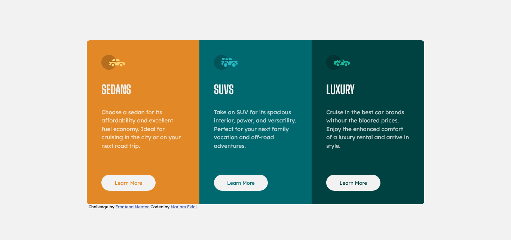

# Frontend Mentor - 3-column preview card component solution

This is a solution to the [3-column preview card component challenge on Frontend Mentor](https://www.frontendmentor.io/challenges/3column-preview-card-component-pH92eAR2-). Frontend Mentor challenges help you improve your coding skills by building realistic projects.

## Table of contents

- [Overview](#overview)
  - [The challenge](#the-challenge)
  - [Screenshot](#screenshot)
- [My process](#my-process)
  - [Built with](#built-with)
  - [What I learned](#what-i-learned)
- [Author](#author)

## Overview

### The challenge

Users should be able to:

- View the optimal layout depending on their device's screen size
- See hover states for interactive elements

### Screenshot



### Links

- Solution URL: [Add solution URL here](https://your-solution-url.com)
- Live Site URL: [Add live site URL here](https://your-live-site-url.com)

## My process

### Built with

- Semantic HTML5 markup
- CSS custom properties
- CSS Grid

### What I learned

I learned how to use grid layout. It's a little bit harder than flexbox layout, but I think it works better for more complex layouts than this simple one
To see how you can add code snippets, see below:

```css
.cards-container {
  width: 70%;
  min-width: 50%;
  height: 80vh;
  max-height: 75vh;
  padding: 2%;
  display: grid;
  grid-template-columns: repeat(3, minmax(200px, 1fr));
}
```

## Author

- Github - [Mariam-Rf](https://github.com/Mariam-Rf)
- Frontend Mentor - [@Mariam-Rf](https://www.frontendmentor.io/profile/Mariam-Rf)
